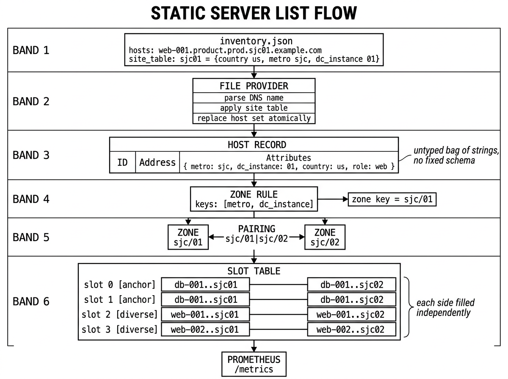
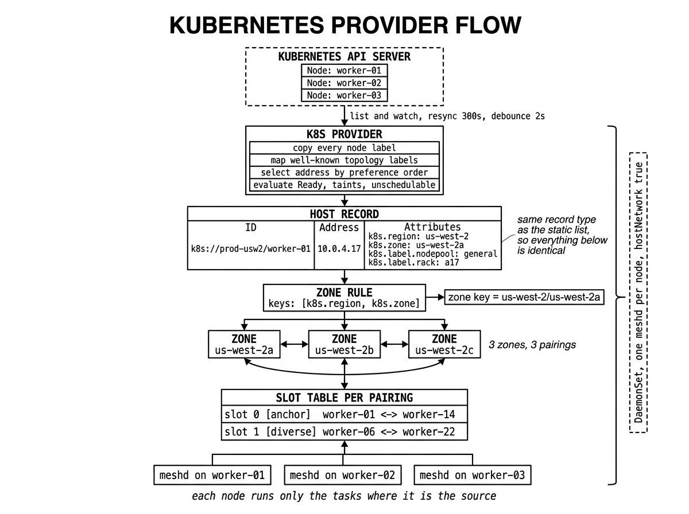
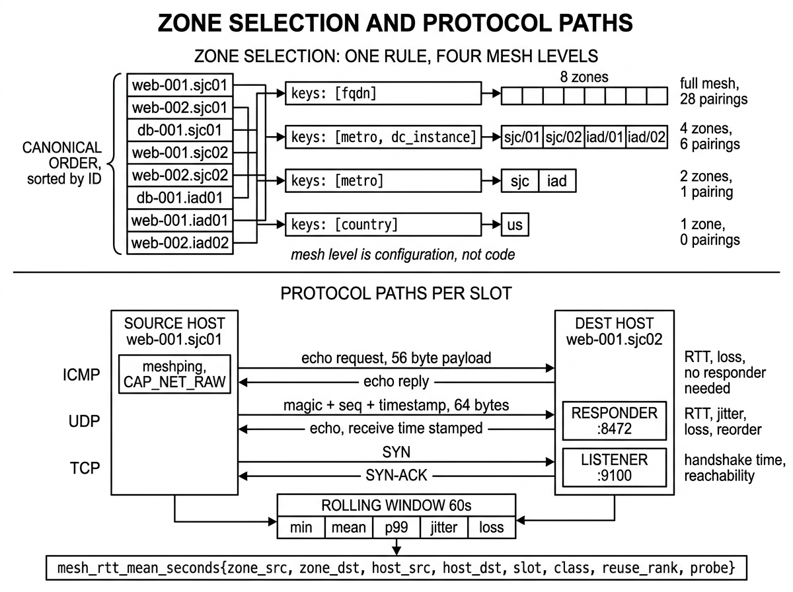

# Mesh Network Test System

A distributed network measurement system. It probes RTT, jitter, packet loss,
reorder, and TCP handshake time between groups of machines, and publishes the
results as Prometheus metrics.

Two binaries:

| Binary | Privilege | Role |
|---|---|---|
| `meshd` | Unprivileged | Discovery, topology, TCP and UDP probes, state, metrics, HTTP API |
| `meshping` | `CAP_NET_RAW` | ICMP echo only. JSON on stdin and stdout |

---

## Diagrams

Three schematics cover the whole system: how a static server list becomes a
slot table, how the same happens from Kubernetes node metadata, and how zone
selection and the three probe protocols relate to each other.

### Static server list



A JSON document is parsed into host records. The DNS name supplies the role,
service, environment, and site; the site table supplies the country and data
centre label that the DNS name has no reason to carry. The zone rule reduces
those attributes to a zone key, zone keys pair up, and the slot table fills.

### Kubernetes provider



The same pipeline, fed from node labels instead of DNS names. The provider
imposes no schema — every label becomes an attribute, and the zone rule decides
which ones matter. Because the host record type is identical, everything below
the provider is the same code. `meshd` runs as a DaemonSet, and each node
measures only the slots where it is the source.

### Zone selection and protocols



The upper half shows one host list resolved four different ways by four
different zone rules, from full mesh down to country level. Changing the mesh
level is a configuration change, not a code change. The lower half shows what
each slot actually measures: ICMP through the privileged helper, UDP against
the echo responder, and TCP against a plain listener, all folded into one
rolling window and exported under one label set.

---

## Why

The naive approach is a full mesh: every machine probes every other machine.
For `n` machines that is `n(n-1)/2` pairs. At 500 machines it is 124,750 pairs,
times three protocols, times two directions. The traffic and the metric
cardinality both become unmanageable.

But you rarely need machine-to-machine data. You need **location-to-location**
data. Whether `sjc01` can reach `sjc02` is the operational question. Which
specific machine in `sjc01` you asked is an implementation detail.

So this system:

1. Groups machines into **zones** by a configurable rule.
2. Forms pairs of **zones**, not pairs of machines.
3. Selects a small, fixed number of machine pairs to represent each zone pair.

Adding 200 machines to `sjc01` adds **zero** measurements, because the zone
count did not change.

Two further problems follow, and the design solves both:

**Distinguishing a bad path from a bad machine.** Each zone pair is measured by
N independent machine pairs, called *slots*. If one slot degrades, the fault is
at an endpoint. If all N degrade together, the fault is in the path.

**Keeping time series continuous.** A Prometheus series is identified by its
labels. If the machine behind a measurement changes, the series breaks and the
graph resets. So slot assignment is sticky: it changes only when it must,
changes as little as possible, and survives process restarts.

---

## How it works

Four steps. Everything else is detail.

### 1. Machines become host records

A host record has an ID, an address, and a bag of **untyped** attributes.

```

ID:         web-001.product.prod.sjc01.example.com
Address:    10.4.2.17
Attributes: {metro: sjc, dc_instance: 01, country: us, role: web, ...}

```

There is no `Country` field, no `Metro` field, no `DataCenter` field anywhere
in the code. Only a map of strings to strings. This is what lets one code path
serve both a DNS-named bare metal fleet and a Kubernetes cluster whose topology
lives in arbitrary node labels.

### 2. A zone rule turns attributes into a zone key

```yaml
zone:
  keys: [metro, dc_instance]    # -> "sjc/01"
```

Changing the mesh level means changing this list, not the code:

| Intent | Rule |
|---|---|
| DC to DC | `[metro, dc_instance]` |
| Metro to metro | `[metro]` |
| Country to country | `[country]` |
| Cloud zone to zone | `[k8s.region, k8s.zone]` |
| Full mesh | `[fqdn]` |

Full mesh is not a special case. It is the rule that puts one machine in each
zone, so a zone pair is a machine pair.

### 3. Zone keys become zone pairings

Every unordered pair of distinct zone keys. The pairing key is the two zone
keys sorted alphabetically and joined with `|`, so every node computes the same
key regardless of which side it is on.

### 4. Slots fill each pairing

```

Pairing "sjc/01|sjc/02"
Slot 0 [anchor]   A: db-001...sjc01   B: db-001...sjc02
Slot 1 [anchor]   A: db-001...sjc01   B: db-001...sjc02
Slot 2 [diverse]  A: web-001...sjc01  B: web-001...sjc02
Slot 3 [diverse]  A: web-002...sjc01  B: web-002...sjc02

```

| Class | Rule | Answers |
|---|---|---|
| **anchor** | All anchor slots use the same host on each side | Endpoints never move, so a change is a *path* change |
| **diverse** | Prefers a host not used elsewhere in this pairing | Spreads across machines, so one bad machine cannot represent the pairing |
| **super** | One host pairs with every host in the far zone | Compares one machine against a whole zone |

**Each slot side is cleared independently.** If one host disappears, only the
sides that held it are cleared and refilled. The other side of that slot, and
every other slot, is untouched. This is the single most important behaviour in
the system.

---

## Determinism

Every node runs its own `meshd`. They do not talk to each other. No leader
election, no consensus protocol.

They agree because the computation is deterministic:

- The inventory is sorted by host ID — the **canonical order**.
- The scan start offset is `fnv32(pairing_key) mod candidate_count`.
- The scan walks the canonical order from that offset and takes the first host
  at the best available rank.
- The pairing key is alphabetically sorted.

Same inventory, same config, same prior state, same result — computed
independently on every machine.

The start offset matters. Without it, every pairing would scan from index 0 and
the alphabetically first host in each zone would hold a slot side in every
pairing, carrying all the load.

---

## Quick start

```bash
git clone <repo> mesh && cd mesh
./build.sh
./meshd -config test/meshd.yaml
```

In another terminal:

```bash
curl -s localhost:9101/tasks | jq '.tasks[] | {dst, kind, mean: .stats.mean}'
curl -s localhost:9101/zones | jq
curl -s localhost:9101/metrics | grep mesh_rtt_mean
```

The `test/` directory holds a working single-host configuration: four hosts,
two zones, all pointing at loopback. It exercises the full path from discovery
through export.

ICMP needs a raw socket:

```bash
sudo setcap cap_net_raw+ep ./meshping
```

If you skip this, `meshd` logs the reason once, sets `mesh_icmp_available` to
0, and continues with TCP and UDP. That is a supported mode, not a failure.

---

## Minimal production configuration

```yaml
node_id: web-001.product.prod.sjc01.example.com   # must match a host ID exactly

providers:
  file:
    enabled: true
    path: /etc/meshd/inventory.json
    interval: 60s

zone:
  keys: [metro, dc_instance]

slots:
  count: 4
  anchor_ratio: 0.5

probes:
  cycle: 15s
  window: 60s
  icmp: { enabled: true,  count: 10, interval: 1s,   timeout: 1s, payload_bytes: 56 }
  udp:  { enabled: true,  count: 10, interval: 1s,   timeout: 1s, payload_bytes: 64, port: 8472 }
  tcp:  { enabled: true,  count: 5,  interval: 5s,   timeout: 2s, port: 9100, mode: connect }

responder:
  enabled: true
  udp_listen: "0.0.0.0:8472"
  tcp_listen: "0.0.0.0:9100"

persist:
  path: /var/lib/meshd/state.json

api:
  listen: "0.0.0.0:9101"
```

Deploy the same file to every node with only `node_id` changed.

**`node_id` must match a host ID exactly.** This is the most common
misconfiguration by a wide margin. A mismatch produces a correct topology and
zero tasks.

Validate before applying:

```bash
meshd -check -config /etc/meshd/meshd.yaml
```

It reports every problem at once, not just the first. A configuration that
fails validation on reload is rejected and the previous one stays active.

---

## Discovery sources

Three providers, one output type. Everything downstream is identical.

| Provider | Source | Attributes from |
|---|---|---|
| `file` | Local JSON document | DNS name parsing plus a site table |
| `http` | Remote JSON document | Same schema, with a local cache |
| `k8s` | Kubernetes `Node` objects | Every node label and allowed annotation |

Each provider produces a **complete** host set and replaces its previous set
atomically. A slow or failing source cannot produce a half-applied topology.

### Static list

```json
{
  "version": 1,
  "site_table": {
    "sjc01": { "country": "us", "metro": "sjc", "dc_label": "sjc-equinix-sv5", "dc_instance": "01" }
  },
  "hosts": [
    { "name": "web-001.product.prod.sjc01.example.com" }
  ]
}
```

`web-001.product.prod.sjc01.example.com` parses to `role=web`, `ordinal=001`,
`service=product`, `environment=prod`, `site=sjc01`, `domain=example.com`. The
site table then supplies `country` and `dc_label`, which the DNS name has no
reason to carry.

### HTTP with cache

The cache is the point. On start it is read and applied **before** the first
fetch, so the node is operational before the network is. A failed fetch keeps
the current set and backs off. A malformed document is never applied. A stale
cache is reported through a gauge but **does not clear slots**.

The config server going down does not stop measurement.

### Kubernetes

Runs as a DaemonSet with `hostNetwork: true`, so probes measure the node
network rather than the CNI overlay. Every node label is available as
`k8s.label.<name>`, plus short keys for the standard topology labels. Host IDs
take the form `k8s://<cluster>/<node>`.

Node scaling up produces **zero** slot changes. Scaling down clears only the
sides that held removed nodes.

Mount the state file on a `hostPath` volume, or every pod restart reassigns
every slot and breaks every series.

---

## Metrics

Every probe metric carries these labels:

```

zone_src, zone_dst, host_src, host_dst, slot, class, reuse_rank, probe

```

The `slot` label is what makes N useful:

```promql
# Is the path bad? Aggregate across slots.
avg by (zone_src, zone_dst) (mesh_rtt_mean_seconds{probe="icmp"})

# Is one host bad? Keep the slot label and look for the outlier.
mesh_rtt_mean_seconds{zone_src="sjc/01", zone_dst="sjc/02", probe="icmp"}
```

Key metrics:

| Metric | Type |
|---|---|
| `mesh_rtt_seconds` | Histogram |
| `mesh_rtt_min_seconds`, `_max_`, `_mean_` | Gauge |
| `mesh_rtt_quantile_seconds` | Gauge, extra `quantile` label |
| `mesh_jitter_seconds` | Gauge |
| `mesh_loss_ratio` | Gauge |
| `mesh_packets_sent_total`, `_received_`, `_lost_` | Counter |
| `mesh_reorder_total` | Counter |
| `mesh_tcp_connect_seconds` | Histogram |
| `mesh_slot_changes_total{reason}` | Counter — assignment churn by cause |
| `mesh_slots_unfilled` | Gauge |
| `mesh_hosts_unresolved` | Gauge — hosts with no zone under the current rule |
| `mesh_icmp_available` | Gauge |
| `mesh_provider_cache_age_seconds` | Gauge |

`metrics.max_series` (default 200,000) caps registration; beyond it samples are
dropped and counted. `pairings.max_pairings` (default 5,000) aborts the
reconcile and **keeps the previous assignment**, so a mistaken zone rule cannot
replace a working topology with an unworkable one.

---

## HTTP API

| Path | Method | Content |
|---|---|---|
| `/metrics` | GET | Prometheus exposition |
| `/state` | GET | Pairings, slots, persistence stats, last delta |
| `/inventory` | GET | Host records with resolved zone keys |
| `/zones` | GET | Zone keys, members, unresolved hosts with the missing key |
| `/pairings` | GET | Pairing keys with fill status |
| `/health` | GET | Per-host state and hysteresis timers |
| `/tasks` | GET | Running tasks with live statistics |
| `/config` | GET | Effective config, secrets redacted |
| `/reconcile` | POST | Force a reconcile, returns the delta |
| `/refresh` | POST | Force a provider poll |
| `/livez`, `/readyz` | GET | Liveness and readiness |

`/tasks` is the most useful debugging endpoint: it shows what this node is
measuring right now, without going through Prometheus.

`/zones` is second: its `unresolved` list names the specific attribute each
excluded host is missing.

Reads come from memory, not from the state file, so a request during the
persistence debounce window returns current data.

---

## Stability

The system is built to avoid unnecessary reassignment.

**A host is not released the moment it fails.** It must fail `unhealthy_after`
cycles, then wait out `release_hold`, before its slot sides are cleared:

```

unknown ──ok──> healthy ──fail──> suspect ──(unhealthy_after)──> pending
                                                                    │
                                                            (release_hold)
                                                                    ↓
                                                                unhealthy
                                                            slot sides clear

```

Four of these states remain eligible to hold a slot. `release_hold` defaults to
60s. Without it, a ten-second network event rewrites assignments and breaks
time series in the exact window where the measurement matters most.

**Change cost:**

| Event | Slot sides changed | Series affected |
|---|---|---|
| One host unhealthy | One per slot that held it | Those slots only |
| One host added | Zero | None |
| Node pool scales up | Zero | None |
| Node pool scales down | One per affected slot | Those slots only |
| `slots.count` raised | New slots only | New series added, existing untouched |
| Restart with state file | Zero | None |
| Zone rule changed | All | All — a topology change, not a repair |

The state file is what makes restarts free. Do not delete it casually.

---

## Repository layout

```

build.sh                       build both binaries, apply setcap if root
go.mod, go.sum

cmd/meshd/main.go              wiring, lifecycle, shutdown order
cmd/meshd/providers.go         provider registration
cmd/meshping/main.go           the entire ICMP helper
cmd/meshping/json.go

pkg/pingproto/proto.go         wire types — the only package both binaries import

internal/config/               structs, defaults, validation, reload watcher
internal/inventory/            HostRecord, Store, Snapshot, merge
internal/zone/                 Rule, transforms, Index
internal/provider/             Provider interface and Manager
internal/provider/file/        local JSON document
internal/provider/http/        remote JSON document with cache
internal/provider/k8s/         Kubernetes node watcher
internal/pairing/              pairing key, filter, Build
internal/slot/                 classes, ranks, scanner, layout
internal/health/               state machine, hysteresis, flap detection
internal/state/                persisted structs, debounced writer
internal/reconcile/            the pure function, and the trigger loop
internal/probe/                Kind, Target, Params, Cycle, Window, Stats
internal/probe/{tcp,udp,icmp}/ the three probers
internal/responder/            UDP and TCP echo listeners
internal/runner/               task lifecycle
internal/metrics/              registry and metric definitions
internal/api/                  HTTP handlers

test/                          working single-host configuration
docs/tech_spec.md              full technical specification
docs/user_manual.md            setup scenarios and operations

```

### Reading order for a new contributor

1. `internal/inventory/inventory.go` — the untyped `Attributes` map. Everything
   follows from that decision.
2. `internal/zone/zone.go` — how a rule turns attributes into a zone key.
3. `internal/pairing/pairing.go` — zone keys to pairings. Short.
4. `internal/slot/slot.go` — classes, ranks, and `StartOffset`. The scan is the
   heart of the determinism.
5. `internal/reconcile/reconcile.go` — the pure function. Read `validateSides`
   and `fillSides` closely; the independent-side rule lives there.
6. `internal/health/health.go` — read `Status.Eligible` and note which states
   return true.
7. `internal/runner/runner.go` — `desired` and `Apply`.
8. `cmd/meshd/main.go` — how it is wired together.

`cmd/meshping/main.go` is independent and can be read alone.

### One structural constraint

`internal/provider` defines the `Provider` interface. The three sub-packages
implement it and therefore import the parent. Construction lives in
`cmd/meshd/providers.go`, not in `internal/provider`, because a package that
defines an interface must not import the packages that implement it. Any new
provider must follow the same shape.

---

## Documentation

| Document | Contents |
|---|---|
| [`docs/tech_spec.md`](docs/tech_spec.md) | Full technical specification: architecture, data model, every algorithm, every metric |
| [`docs/user_manual.md`](docs/user_manual.md) | Installation, eight deployment scenarios, protocol tuning, Prometheus queries, troubleshooting |

---

## Requirements

- Go 1.22 or later
- Linux (`CAP_NET_RAW` handling and the unprivileged ICMP datagram path are
  Linux-specific)
- Prometheus, for collection

Dependencies: `prometheus/client_golang`, `golang.org/x/net`, `gopkg.in/yaml.v3`,
`k8s.io/client-go`.

---

## Known limitations

| Item | Status |
|---|---|
| `rebalance_on_add` | Accepted and validated; not acted on. Defaults false |
| `reclaim` | Same |
| `probes.icmp.df` | Accepted; not applied. Setting DF is not portable through the Go ICMP library |
| Setuid for `meshping` | Not supported. Use `setcap`, or the unprivileged ICMP datagram socket |
| One-way delay | The responder stamps its receive time into the reply, but `meshd` does not yet compute one-way delay. The wire format supports it |
| IPv6 | Sockets are opened and the protocol carries a flag, but family selection is driven by resolution rather than configuration |

---

## License

MIT
